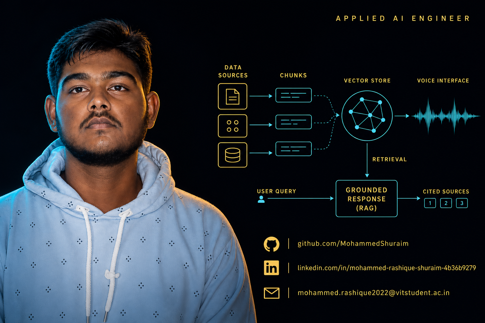

<!-- Applied AI Engineer · Ink #070A12 · Brass #D4AF6A · Signal cyan #38D8F0 -->

  

---

  

  <h2>Mohammed Rashique Shuraim</h2>
  <h3>Applied AI Engineer</h3>

I build **production AI systems** that have to be right in the real world: a lawyer asking a statute, an investor asking about holdings, an operator speaking a command to their desktop.

The model is never the product. The product is the loop around it — capture the signal, retrieve or transcribe, constrain the generation to sources that exist, return a structured answer, and put it in an interface a stranger can use.

I am studying at **VIT Chennai** (`22MIS1040`) and shipping applied AI for Indian-language and Indian-market problems.

**GitHub** · [github.com/MohammedShuraim](https://github.com/MohammedShuraim)

**LinkedIn** · [linkedin.com/in/mohammed-rashique-shuraim-4b36b9279](https://www.linkedin.com/in/mohammed-rashique-shuraim-4b36b9279)

**Email** · [mohammed.rashique2022@vitstudent.ac.in](mailto:mohammed.rashique2022@vitstudent.ac.in)

---

  

---

## What I ship

These are not notebooks. Each one is a full product: interface, model, retrieval or speech, API, and a cloud path.

<table>
<tr>
<td width="33%" valign="top">

### LexCloud
**Indian-law counsel on AWS**

Upload a statute or contract. Ask from the **PDF (RAG)**. Translate the full document into Hindi, Tamil, Telugu, Malayalam, or Kannada. **Whisper** in. **Amazon Polly** out.

[Repository](https://github.com/MohammedShuraim/LexCloud) · [Live](https://main.d2pw2pic3w5m1.amplifyapp.com) · [Watch](https://www.loom.com/share/ed575fdabd3142d5bef7168b4414385a)

</td>
<td width="33%" valign="top">

### Sentellent AI
**NSE investment desk**

Investor profile → ranked picks → paper trade → watchlist → news. Chat is injected with **holdings and watchlist**, so the analyst cannot forget what you already own.

[Repository](https://github.com/MohammedShuraim/sentinel-ai) · [Live](http://sentellent007.duckdns.org:3000) · [Watch](https://www.loom.com/share/ff398d09217c42568d1778d3608317ee)

</td>
<td width="33%" valign="top">

### Sarah
**Desktop voice agent**

Wake word. Silence-aware recording. 34 spoken OS commands. Conversational fallback on Groq GPT-OSS. One `Assistant` class drives CLI and the React push-to-talk client.

[Repository](https://github.com/MohammedShuraim/sarah-voice-assistant) · [Watch](https://www.loom.com/share/d10d493df9b44a54be501d36abeffb75)

</td>
</tr>
</table>

---

## How I treat a model

  

**If the source did not say it, the model does not get to invent it.**

I design against four failure modes:

| Failure | What it looks like | What I do |
| --- | --- | --- |
| **Hallucination** | A sentence the source never supported | Retrieve first. Bound the prompt. Cite. |
| **Transcription drift** | The wrong word at the start of the pipeline | Whisper in, then route; do not “clean up” facts with an unconstrained LLM |
| **Stale context** | Chat that forgets the PDF, portfolio, or last command | Inject holdings, watchlist, or document into every turn |
| **Latency** | RAG and voice that feel like a batch job | Serverless and Groq where the round-trip has to stay conversational |

---

## Stack from shipped systems

Not a wish list. This is what is actually in LexCloud, Sentellent AI, and Sarah.

### Languages

  
  
  
  
  
  

### Applied AI

  
  
  
  
  
  
  
  

### Product & backend

  
  
  
  
  
  
  

### Cloud & data

  
  
  
  
  
  
  
  
  
  
  
  

---

## Signal

