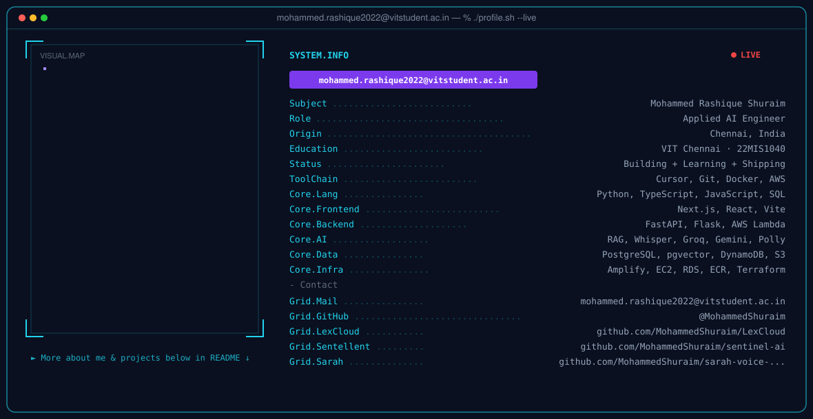

<!-- Theme: Ink #070A12 · Brass #D4AF6A · Signal cyan #38D8F0 · Neural violet #7C6CFF -->

<div align="center">
<picture>
  <source media="(prefers-color-scheme: dark)" srcset="hero-dark.png">
  <source media="(prefers-color-scheme: light)" srcset="hero-light.png">
  
</picture>
</div>

---

<div align="center">


<p><b>Mohammed Rashique Shuraim</b></p>
<p>Applied AI Engineer</p>

I design <b>production AI systems</b> — retrieval that cites the document, voice that routes a command or answers, agents that already know the user’s context.

**Theme** · Ink (`#070A12`) · Brass (`#D4AF6A`) · Signal cyan (`#38D8F0`) · Neural violet (`#7C6CFF`)

[](https://www.linkedin.com/in/mohammed-rashique-shuraim-4b36b9279)
[](https://github.com/MohammedShuraim)
[](mailto:mohammed.rashique2022@vitstudent.ac.in)
[](https://www.python.org/)
[](https://www.typescriptlang.org/)
[](https://aws.amazon.com/)

[LexCloud](https://github.com/MohammedShuraim/LexCloud) · [Sentellent AI](https://github.com/MohammedShuraim/sentinel-ai) · [Sarah](https://github.com/MohammedShuraim/sarah-voice-assistant)

</div>

---

<div align="center">

<picture>
  <source media="(prefers-color-scheme: dark)" srcset="dark.svg">
  <source media="(prefers-color-scheme: light)" srcset="light.svg">
  
</picture>

</div>

---

## What I ship

These are not notebooks. Each one is a product loop: interface, model, retrieval or speech, API, and a cloud path a stranger can open.

<table>
<tr>
<td width="33%" valign="top">

### LexCloud
**Indian-law counsel on AWS**

Upload a statute or contract. Ask from the **PDF (RAG)**. Translate the full document into Hindi, Tamil, Telugu, Malayalam, or Kannada. **Whisper** in. **Amazon Polly** out.

Amplify · Lambda · API Gateway · S3 · DynamoDB · Groq

[Repository](https://github.com/MohammedShuraim/LexCloud) · [Live](https://main.d2pw2pic3w5m1.amplifyapp.com) · [Watch](https://www.loom.com/share/ed575fdabd3142d5bef7168b4414385a)

</td>
<td width="33%" valign="top">

### Sentellent AI
**NSE investment desk**

Investor profile → ranked picks → paper trade → watchlist → news. The analyst chat is injected with **holdings and watchlist**, so it cannot forget what you already own.

Next.js · FastAPI · PostgreSQL / pgvector · Docker · Terraform · Gemini

[Repository](https://github.com/MohammedShuraim/sentinel-ai) · [Live](http://sentellent007.duckdns.org:3000) · [Watch](https://www.loom.com/share/ff398d09217c42568d1778d3608317ee)

</td>
<td width="33%" valign="top">

### Sarah
**Desktop voice agent**

Wake word. Silence-aware recording. 34 spoken OS commands. Conversational fallback on Groq GPT-OSS. The same `Assistant` class drives CLI and the React push-to-talk client.

Python · Flask · React 19 · Vite · Whisper · gTTS

[Repository](https://github.com/MohammedShuraim/sarah-voice-assistant) · [Watch](https://www.loom.com/share/d10d493df9b44a54be501d36abeffb75)

</td>
</tr>
</table>

---

## How I treat a model

```text
signal → retrieve or transcribe → constrained generation → structured reply → interface
              ↑                         |
              └── PDF / holdings / last command
```

Four failure modes I design against:

1. **Hallucination** — a sentence the source never supported.
2. **Transcription drift** — the wrong word at the start of the pipeline.
3. **Stale context** — chat that forgets the document, portfolio, or last command.
4. **Latency** — RAG and voice die if the round-trip feels like a batch job.

If the source did not say it, the model does not get to invent it.

---

## Stack from shipped systems

<p>
  
  
  
  
  
  
  
  
  
  
  
  
</p>

---

## Signal

<div align="center">

<picture>
  <source media="(prefers-color-scheme: dark)" srcset="https://streak-stats.demolab.com?user=MohammedShuraim&hide_border=true&background=070A12&stroke=38D8F0&ring=D4AF6A&fire=38D8F0&currStreakLabel=D4AF6A&sideLabels=8B93A7&currStreakNum=E8ECF4&sideNums=E8ECF4&dates=8B93A7&title_color=38D8F0" />
  
</picture>

<a href="https://github.com/MohammedShuraim">
  <picture>
    <source media="(prefers-color-scheme: dark)" srcset="https://github-readme-stats.vercel.app/api?username=MohammedShuraim&show_icons=true&include_all_commits=true&hide_rank=true&hide_border=true&title_color=D4AF6A&icon_color=38D8F0&text_color=8B93A7&bg_color=070A12" />
    
  </picture>
</a>
<a href="https://github.com/MohammedShuraim">
  <picture>
    <source media="(prefers-color-scheme: dark)" srcset="https://github-readme-stats.vercel.app/api/top-langs/?username=MohammedShuraim&layout=compact&langs_count=6&hide_border=true&title_color=D4AF6A&text_color=8B93A7&bg_color=070A12" />
    
  </picture>
</a>

<picture>
  <source media="(prefers-color-scheme: dark)" srcset="https://raw.githubusercontent.com/MohammedShuraim/MohammedShuraim/output/github-snake-dark.svg" />
  <source media="(prefers-color-scheme: light)" srcset="https://raw.githubusercontent.com/MohammedShuraim/MohammedShuraim/output/github-snake.svg" />
  
</picture>

</div>

---

<div align="center">

Studying at **VIT Chennai** (`22MIS1040`). Building applied AI for Indian-language and Indian-market problems.

[LinkedIn](https://www.linkedin.com/in/mohammed-rashique-shuraim-4b36b9279) · [Email](mailto:mohammed.rashique2022@vitstudent.ac.in) · [GitHub](https://github.com/MohammedShuraim)

</div>
